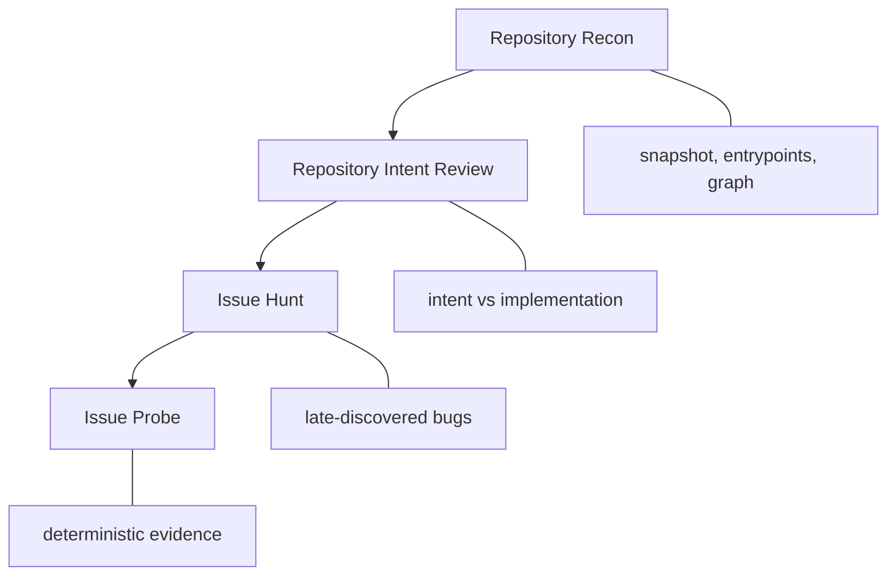

<p align="center">
  
</p>

<h1 align="center">AIssuer</h1>

<p align="center">
  Finds an issue before production does.
</p>

<p align="center">
  
  
  
  
</p>

AIssuer is a host-first plugin for Codex, Claude, and Cursor. It starts by mapping the repository, then checks intended behavior, then hunts the harder mature-repo bugs, and finally probes the shortlist with deterministic evidence.

## Workflow



## Levels

| Level | Skill | Focus |
| --- | --- | --- |
| Understand | `Repository Recon` | snapshot, entrypoints, graph, repository map |
| Check intent | `Repository Intent Review` | intended behavior vs implementation |
| Hunt | `Issue Hunt` | mature bugs, drift, edge cases, hidden failure paths |
| Probe | `Issue Probe` | deterministic evidence for shortlisted issues |

## Install in your IDE

Paste one of these prompts into the host you want to use.

Codex:

```text
Add https://github.com/hi-mundo/AIssuer as a plugin source or marketplace for this workspace, install the AIssuer plugin, enable it here, and confirm the plugin is active. After installed show me the capabilities and examples of how to use.
```

Claude:

```text
Add https://github.com/hi-mundo/AIssuer as a plugin source or marketplace for this project, install the AIssuer plugin, enable it here, and confirm the plugin is active. After installed show me the capabilities and examples of how to use.
```

## What you get

- plugin inside Codex, Claude, or Cursor
- BYOK-compatible local execution for testing and automation
- CLI surfaces for evals, benchmarks, and manual runs

## Current signal

- validated historical benchmark: 40/40 cases inside the top 20
- details: [benchmarks/README.md](./benchmarks/README.md)
- method: [PAPER.md](./PAPER.md)
- implementation: [IMPLEMENTATION.md](./IMPLEMENTATION.md)
- usage modes: [USAGE.md](./USAGE.md)
- eval runtime: [evals/README.md](./evals/README.md)

## Why this exists

Most AI code review is still too shallow for late-discovered bugs in mature software. AIssuer is meant to make the agent ask better questions before it guesses:

- what is the product supposed to guarantee
- where does the implementation drift from intent
- which surfaces are historically brittle
- which hypotheses are worth probing first

## License

MIT
